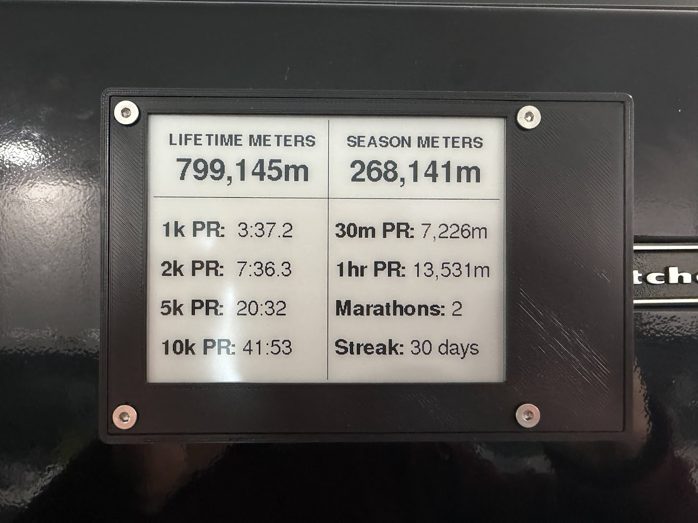

## Project Overview

<p align="center">

</p>

This software stack is designed to accompany my [Waveshare 4.2" Magnetic Dashboard model on Printables](https://www.printables.com/model/1754374-waveshare-42-magnetic-e-ink-dashboard-w-button-par/), however it may also be useful to those looking to collect and maintain local copies of their Concept2 Logbook data.

Once the user adds their Concept2 Logbook API token, the Python script (./app/fetch_c2.py) will:

- Ingest all workouts in the logbook history on first run (and new workouts on subsequent runs), saving them locally at ./data/workout_history_cache.json.
- Work from oldest to newest to build a Personal Record (PR) history, saving in ./data as .csv files.
- Count the number of marathons (Concept2 defines a marathon as a fixed distance workout of exactly 42,195 meters).
- Track the user's daily streak, e.g. how many sequential days they have rowed.
- Parse the user's total lifetime meters rowed, season meters, best PRs, marathons rowed, and streak to a single file at ./www/rowing_stats.json which can be easily served and ingested by the ESP32 used in this project.

Also included is a simple server integration: a webhook so the ESP32 can command the server to run the Python script, and an Nginx sidecar to serve the updated rowing stats summary for the ESP32 to ingest.

Setting up as instructed will grant read-only access to your Concept2 Logbook data, so there is no risk to your stats!

### How the local PR logic works

The script will work from oldest to newest in the workout history to build a PR history. Note that PRs are only triggered for the following workouts:

- Timed PR for **exact distance matches** for the following distances: 1k, 2k, 5k, 10k meters
- Distance PR for **exact time matches** for the following timed workouts: 30 minutes, 1 hour

Interval workouts will not trigger a PR, e.g. a 10 x 500m interval workout will add 5000 meters (plus rest meters, if applicable) to your lifetime/season meters, but it will not touch your 5k PR.

To override the exact match logic and create a new PR for a workout that doesn't match the exact filters, comment parsing is performed.
For example, you rowed for 45 minutes, but 43:42 into the workout you hit 10,000 meters, a new PR.
When submitting the workout to your Concept2 Logbook, write in the comments field something like "new 10k PR 43:42".
The script will ingest your workout total meters and time, but parse the comment and append the new PR to the 10k_PR.csv file.

The exact verbiage for a comment PR is not important.
As long as you include the distance or time string (1k, 2k, 5k, 10k, 30min, 1hr) and a valid colon-separated clock time (MM:SS or HH:MM:SS), you can write whatever else you want.
The time strings are fuzzy so things like "30min", "30 min", "30 mins", "30 minutes", "1hr" "1 hr" "1 hour" will all trigger to attempt to process a new PR.

## Full Setup Instructions

### Setting Up the Backend to Pull from Concept2 API
1. For the easiest configuration, clone this repo to a folder named 'erg-fridge-display-backend' while in your server's Docker project folder:
   ```
   git clone https://github.com/jacobdesforges/concept2-rowing-stats-server.git erg-fridge-display-backend
   ```
2. Rename .env.example to .env. Follow the instructions in .env to obtain and set your Concept2 API key and set up your local networking config.
3. Compose up the project.
4. While in the project root folder, run the following to fetch all of your historical Concept2 logbook data and create the local database:
   ```
   docker exec -it erg-fridge-display-backend python3 /app/fetch_c2.py
   ```

### Serve the stats on your local network as a systemd service
1. If your server doesn't have it, install the `webhook` package.
2. systemd requires absolute paths. Run `which webhook` and note the path. Debian returns `/usr/bin/webhook`
3. Rename erg-backend-hook.example.json to erg-backend-hook.json, and edit the file.
4. Modify the "execute-command" line to point to the `which webhook` path. Modify the "command-working-directory" line to point to your project root folder.
5. Open erg-backend-hook.example.service. Modify the file according to the comments. Copy the entire contents.
6. Create a new service config file as root, and paste in the contents of erg-backend-hook.example.service:
   ```
   sudo nano /etc/systemd/system/erg-backend-hook.service
   ```
7. Reload the systemd manager configuration to recognize the new service, enable it to run on boot, and start it immediately:
   ```
   sudo systemctl daemon-reload
   sudo systemctl enable erg-backend-hook.service
   sudo systemctl start erg-backend-hook.service
   ```
8. Check the status and the logs at any time:
   ```
   sudo systemctl status erg-backend-hook.service
   journalctl -u erg-backend-hook.service -f
   ```

### Upload the sketch to your ESP32

[Assembly instructions for the hardware are on Printables](https://www.printables.com/model/1754374-waveshare-42-magnetic-e-ink-dashboard-w-button-par/). 

1. Plug in the ESP32 via USB-C to your computer.
2. Discover ESP32 hardware address if it's your only serial device: `ls /dev/ttyUSB* /dev/ttyACM* 2>/dev/null`. Mine is at /dev/ttyACM0.
3. On Fedora and some other distros, your local user account cannot talk directly to hardware raw data tty nodes unless you are part of the hardware control group.
   Run the following user modification command so your account can execute raw writes over that port without needing root privileges:
   `sudo usermod -a -G dialout $USER`

   To apply, log out and back in, or run in the active terminal window `newgrp dialout`.
4. If you don't have arduino-cli, download and install it to your home bin directory:
   ```
   curl -fsSL https://raw.githubusercontent.com/arduino/arduino-cli/master/install.sh | BINDIR=~/bin sh
   ```
   Ensure it's working with `arduino-cli version`.
5. If you have multiple serial devices, can run `arduino-cli board list` now to find hardware address. 
6. Create a fresh config file: `arduino-cli config init`
7. Append the official ESP32 board manager package URL:
   ```
   arduino-cli config set board_manager.additional_urls https://espressif.github.io/arduino-esp32/package_esp32_index.json
   ```
8. Update the index files: `arduino-cli core update-index`
9. Install the core platform files for ESP32 (this replaces the graphical Board Manager): `arduino-cli core install esp32:esp32`
10. In the esp32 folder, rename secrets.h.example to secrets.h and change the variables according to the instructions.
11. Still in ./esp32, compile the sketch targetting the generic ESP32 platform:
   `arduino-cli compile --fqbn esp32:esp32:esp32 .`
12. If you get a compilation error for missing libraries, e.g. fatal error: # GxEPD2_BW.h: No such file or directory, you need to install them:
   `arduino-cli lib install "GxEPD2" "ArduinoJson" "Adafruit GFX Library"`
13. Upload the binary code over the physical serial cable path (replace /dev/tty**** path with your output from earlier step)
   `arduino-cli upload -p /dev/ttyACM0 --fqbn esp32:esp32:esp32 .`
14. Unplug from USB-C.
15. Test the button click logic, a single click should update stats and print to the display. Double click will enter maintenance mode for 2 mins to allow updating the sketch.
16. After double click, test that your ESP32 has network access: `ping -c 4 erg-fridge-display.local`
17. Once everything is working, assemble your hardware. 

### Common Issues:

#### Update OTA Later

Uploading over Wi-Fi, I was having trouble resolving the .local hostname in combination with an upload. So I switched to using the IP discovered in step 16 above.

For any changes to the .ino, just compile again and send with below. Hit enter if it asks for a password:

`arduino-cli upload -p 192.168.1.X -l network --discovery-timeout 15s --fqbn esp32:esp32:esp32 .`

#### Changing ports

By default, this stack is set to run on port 8080 (Python script webhook) and port 8081 (rowing_stats.json Nginx server).

If you're already running services on these ports, you will have to change them in:

- ./docker-compose.yml
- erg-backend-hook.service (if you haven't already copied contents to `/etc/systemd/system/erg-backend-hook.service`
- ./esp32/ErgDisplayBaseline.ino under the // --- Server Configuration --- section

#### I want to use this for Concept2 machines other than the RowErg

Quite simple.The script as writen will ingest *all* Concept2 Logbook data, but only count meters on the standard RowErg. Look in .app/fetch_c2.py for the line `if workout.get("type") != "rower":`, which causes the script to exit the loop if the workout was not performed on the standard RowErg.

[Check the Concept2 Logbook API here for all possible machine types](https://log.concept2.com/developers/documentation/#logbook-users-results-get). Note the Dynamic RowErg and RowErg w/ slides are considered separate machine types.

If things you want to count aren't counting after adjusting the Python script logic, check what's been ingested in ./data/workout_history_cache.json for clues.
